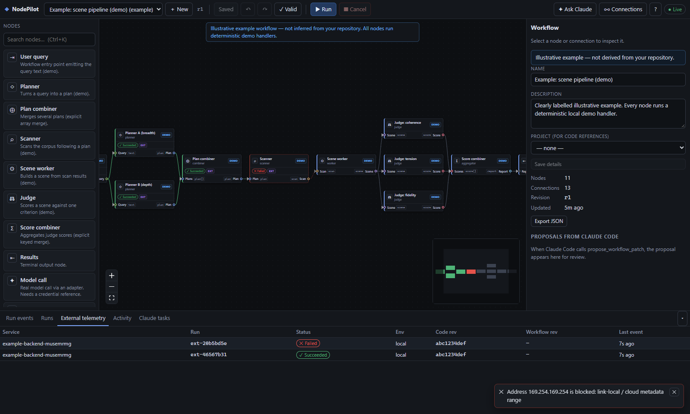

# NodePilot

A local-first workspace for visually managing AI systems: represent planners, scanners,
workers, judges, aggregators, API services and outputs as typed, connected nodes; run
them locally; watch real execution events; let **Claude Code** inspect and edit the
workflow over **MCP**; and send reviewed coding tasks to a **paired local Claude Code
runner** that works in an isolated git worktree and reports diffs and test results.

> Single-user local MVP. Nothing is hosted, nothing is deployed, no paid infrastructure
> is required. Branding is configurable (`NODEPILOT_APP_NAME`).



## What works locally

| Area | Status |
| --- | --- |
| Canvas (React Flow): typed ports, palette, inspector (8 tabs), timeline, minimap, zoom/fit, undo/redo, shortcuts | ✅ |
| Versioned schema, single authoritative validation + persistence layer, optimistic concurrency, audit log | ✅ |
| Validation: missing inputs, incompatible ports, cycles, invalid settings, missing implementations/credentials, secrets in params | ✅ |
| Local execution: dependency scheduling, bounded parallelism, explicit fan-in merge, timeouts, cancellation, safe-only retries, run history, redacted/truncated I/O | ✅ |
| Seeded **illustrative** example with deterministic demo handlers (outputs labelled demo data) | ✅ |
| MCP server (stdio) for Claude Code; changes appear live on the canvas | ✅ (exercised via the official SDK client over stdio) |
| Paired runner → `claude -p --output-format stream-json` in a git worktree, diff + tests, cancel | ✅ (verified once against Claude Code 2.1.288) |
| Workflow ⇄ JSON file sync with debouncing and loop prevention; VS Code links | ✅ |
| Backend monitoring: health endpoints + authenticated execution telemetry, dedup/out-of-order | ✅ (with the bundled example backend) |
| GitHub App adapter: repo/branch, commits, PRs, checks, workflow runs; webhook verify/dedupe/associate | ⚠️ implemented and unit-tested; **live GitHub API untested** (needs your App credentials) |
| Model adapter (Anthropic Messages API) | ⚠️ implemented; **live call untested** (needs an API key) |

See [docs/VERIFICATION.md](docs/VERIFICATION.md) for exactly what was tested and how.

## Requirements

- Node.js **22.13+** (uses the built-in `node:sqlite`; developed on Node 24). npm 10+.
- git (for the Claude runner's worktrees).
- Optional: [Claude Code](https://docs.claude.com/en/docs/claude-code/setup) CLI, signed in, for the runner and MCP.
- Optional: Chrome or Edge to run the browser acceptance scripts.

## Quick start

```bash
npm install
npm run build          # builds every package and the web app
npm start              # http://127.0.0.1:4317
```

Open <http://127.0.0.1:4317>. Browser pairing is currently **disabled by default**: any
request that passes the loopback Host/Origin checks acts as you. To require a one-time
pairing code again, set `NODEPILOT_REQUIRE_PAIRING=1` (then `npm run pair` issues new codes).

The bundled workflow **"Example: scene pipeline (demo)"** is illustrative only. Press **Run**.

### Development mode (hot reload)

```bash
npm run build          # once: shared packages must be built
npm run dev            # API on :4317 (tsx watch) + Vite on :5173 (proxying /api)
```
Open <http://127.0.0.1:5173>.

## Components and commands

| Component | Command | Notes |
| --- | --- | --- |
| Server + web app | `npm start` | Fastify, SQLite (`.data/nodepilot.db`), SSE at `/api/stream`, serves `apps/web/dist` |
| New browser pairing code | `npm run pair` | only when `NODEPILOT_REQUIRE_PAIRING=1`; single use, 15 min |
| MCP server (stdio) | `npm run mcp` | normally launched by Claude Code, see [docs/MCP.md](docs/MCP.md) |
| Claude runner | `npm run runner -- --project <repo> [--test-cmd "npm test"]` | see [docs/RUNNER.md](docs/RUNNER.md) |
| Example instrumented backend | `NODEPILOT_INGEST_TOKEN=npi_… npm run example-backend` | see [docs/INSTRUMENTATION.md](docs/INSTRUMENTATION.md) |
| Type check / tests / build | `npm run typecheck`, `npm test`, `npm run build`, or all: `npm run verify` | tests never call paid models |
| Browser acceptance flow | `node scripts/e2e-acceptance.mjs` | server must be running; uses a fake Claude CLI unless `E2E_CLAUDE_BIN=claude` |
| Browser monitoring check | `node scripts/e2e-monitoring.mjs` | starts the example backend itself |
| Local webhook test | `node scripts/github-webhook-test.mjs owner/repo push` | needs `GITHUB_WEBHOOK_SECRET` |

Configuration: copy `.env.example` to `.env`. Database migrations live in
`apps/server/migrations/*.sql` and are applied automatically at startup.

## Typical flow

1. **Edit**: drag nodes from the palette, connect typed ports (incompatible or cyclic connections are refused), edit in the inspector and **Save** (Ctrl+S).
2. **Claude Code via MCP**: `claude mcp add …` (Connections → *Claude Code MCP* shows the exact command), then ask Claude to inspect or patch the workflow. Changes show up live, marked as coming from MCP; proposals wait for your review.
3. **Run**: Ctrl+Enter. Node cards and edges reflect recorded events only. Inspect failures in *Errors & events*.
4. **Ask Claude**: on a node, *Ask Claude* → review the exact task text → choose a paired runner, project and permission mode → approve. Watch progress, then review the **diff** and **test output**. Nothing is merged or pushed.
5. **Monitor** your own backend: create a service (Connections → Backends), instrument it with `@nodepilot/instrument`, add its health endpoint.

## Documentation

- [Architecture, security model and limitations](docs/ARCHITECTURE.md)
- [Claude Code MCP setup](docs/MCP.md)
- [Claude runner pairing and safety](docs/RUNNER.md)
- [GitHub App setup and local webhook testing](docs/GITHUB.md)
- [Backend instrumentation](docs/INSTRUMENTATION.md)
- [Verification results](docs/VERIFICATION.md)
